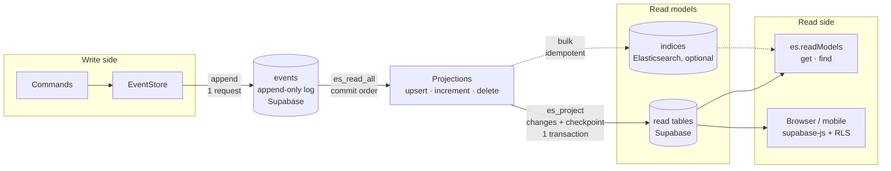
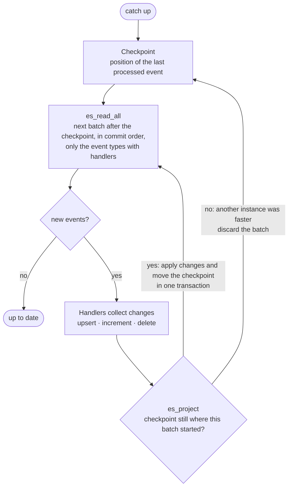
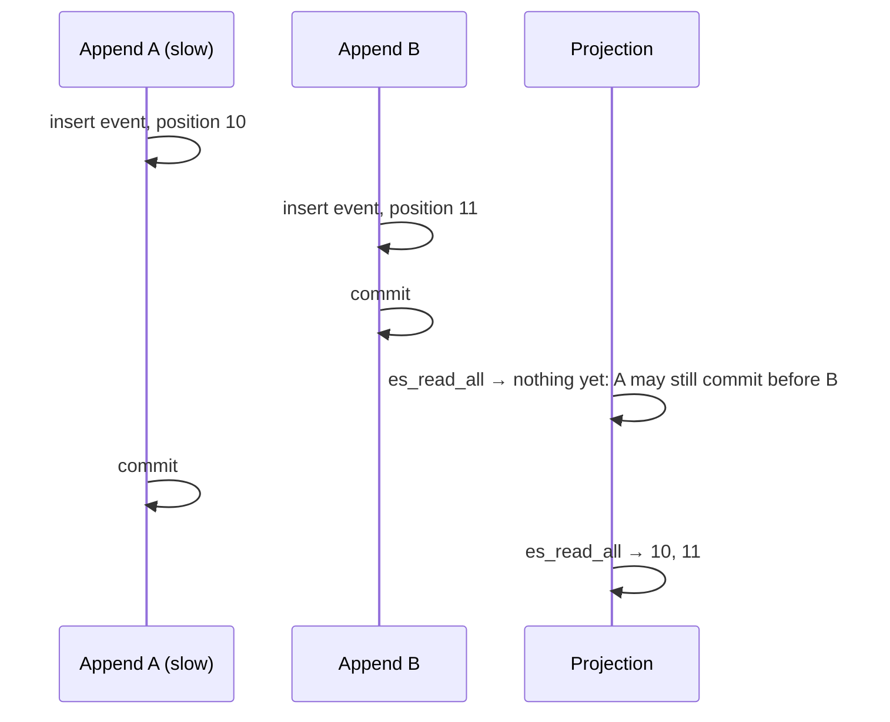
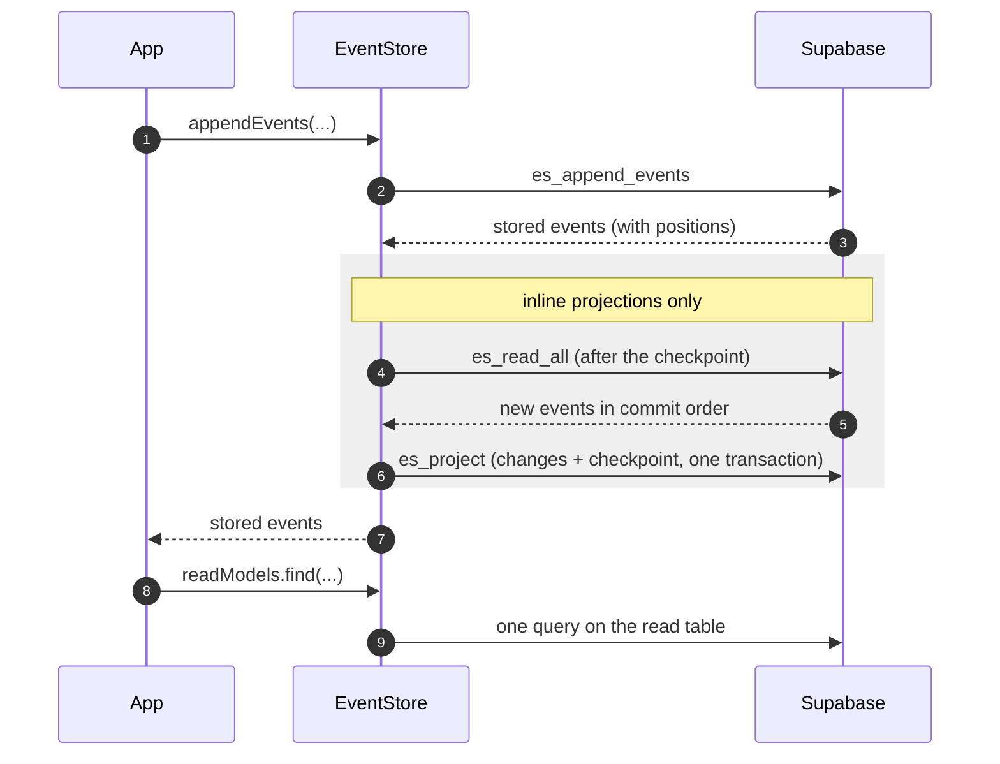
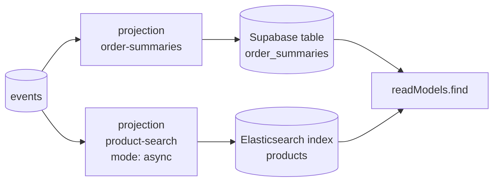
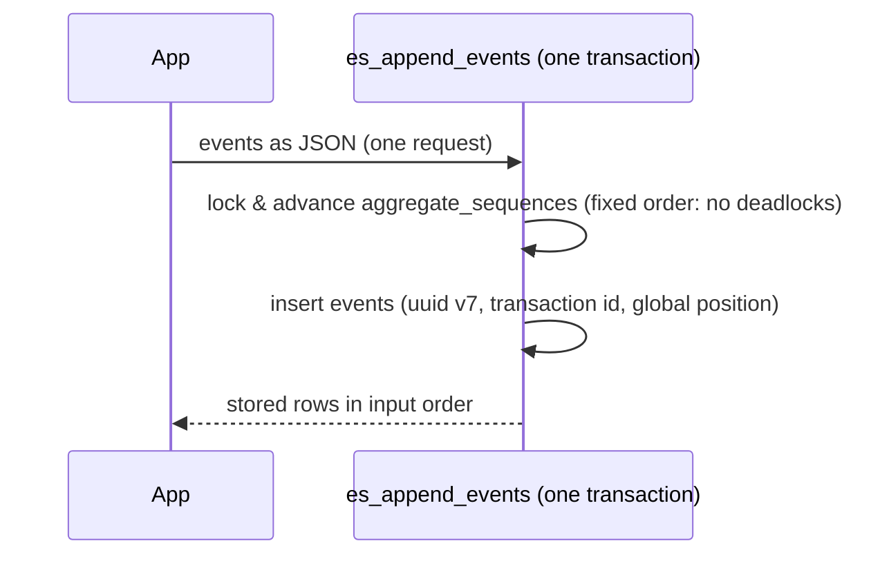
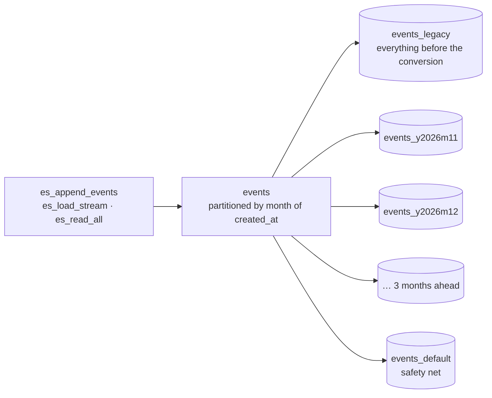
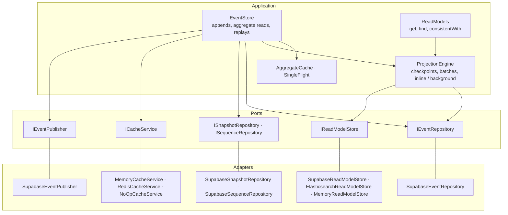

# Event Store

Event Sourcing and CQRS for Supabase, written in TypeScript. Events are the source of truth; **projections** turn them into **read models** – ordinary Supabase tables or, optionally, Elasticsearch indices – that queries read directly instead of replaying events. Built on Ports & Adapters, with an in-memory cache out of the box and Redis as an option.

[](https://www.typescriptlang.org/)
[](LICENSE)



## Contents

- [Features](#features)
- [Installation](#installation)
- [Quick Start](#quick-start)
- [Write side: events, aggregates, snapshots](#write-side-events-aggregates-snapshots)
- [Read side: projections and read models (CQRS)](#read-side-projections-and-read-models-cqrs)
- [Elasticsearch (optional)](#elasticsearch-optional)
- [Supabase database: setup and optimizations](#supabase-database-setup-and-optimizations) – incl. [monthly partitions](#monthly-partitions-optional) and [audit logging](#immutable-events-and-audit-logging-optional)
- [Caching & consistency of aggregate reads](#caching--consistency-of-aggregate-reads)
- [Performance](#performance)
- [Architecture](#architecture)
- [Configuration](#configuration)
- [Custom adapters & testing](#custom-adapters--testing)
- [Best practices](#best-practices)
- [Upgrading](#upgrading)

## Features

**Write side (event sourcing)**
- Appends of single events and batches in one request, with atomic, gap-free sequence numbers per aggregate
- Aggregate streams, filtered queries, replay with projections, point-in-time state, statistics, stream validation
- Snapshots, real-time subscriptions (Supabase Realtime)

**Read side (CQRS)**
- Projections write read models from events: upserts, increments and deletes, collected per batch
- **Exactly once** in Supabase: every batch of changes is stored together with the projection's checkpoint in one transaction, also with several app instances
- Events are read in **commit order**: no event is skipped, even when transactions commit out of order
- **Read-your-writes**: inline projections are up to date when an append returns; async projections keep appends at one request and catch up on demand (`consistentWith`)
- Store-independent queries (filter, full-text search, sort, paging, count) – or query the tables directly with supabase-js, also from the browser under row level security
- Rebuilds by version bump, background processing, monitoring in SQL
- **Elasticsearch** as an optional read model store, per projection

**Performance**
- In-memory cache for aggregate reads, Redis optional; incremental loading; concurrent identical reads share one request
- Database functions: appends and aggregate loads in one round trip, statistics computed in the database
- Write-optimized schema: time-ordered UUIDs, lz4 compression, tuned autovacuum, HOT updates, report of redundant indexes
- Optional: monthly partitions of the events table, immutable events and audit logging with pgaudit

**Architecture**
- Ports & Adapters, every adapter replaceable (custom databases, caches, read model stores), fully typed

## Installation

```bash
npm install @beatbrackerz/eventstore @supabase/supabase-js
```

`@supabase/supabase-js` (≥ 2.91) is a peer dependency. Optional: `ioredis` for a cache shared between instances, `@elastic/elasticsearch` (8 or newer) for Elasticsearch read models. Requires Node.js 22 or newer.

## Quick Start

### 1. Database setup

Run [`sql/eventstore.sql`](sql/eventstore.sql) in the Supabase SQL editor, with `psql`, or as a migration (`supabase migration new eventstore`). It ships with the package: `node_modules/@beatbrackerz/eventstore/sql/eventstore.sql`. The script is safe to run on existing installations and safe to run again – see [what it does](#what-sqleventstoresql-does).

### 2. Create the event store

Use the event store on the **server** with the **service role key**. The anon key is meant for browsers: with it, anyone can call your Supabase API with the same rights as your server.

```typescript
import { createClient } from '@supabase/supabase-js';
import { createEventStore } from '@beatbrackerz/eventstore';

const supabase = createClient(process.env.SUPABASE_URL!, process.env.SUPABASE_SERVICE_ROLE_KEY!, {
  auth: { persistSession: false, autoRefreshToken: false },
});

const eventStore = createEventStore({ supabase });
```

### 3. Append events

```typescript
const orderId = crypto.randomUUID();

await eventStore.appendEvents([
  {
    type: 'OrderCreated',
    aggregate_id: orderId,          // UUID
    aggregate_type: 'order',
    created_by: userId,             // UUID of the acting user, e.g. a Supabase auth user id
    payload: { customerId, title: 'Running shoes' },
  },
  {
    type: 'ItemAdded',
    aggregate_id: orderId,
    aggregate_type: 'order',
    created_by: userId,
    payload: { sku: 'SHOE-42', price: 89.9 },
  },
]);
```

### 4. Add a read model

A read model is a table shaped for your queries. Create it once (SQL editor or migration):

```sql
create table public.order_summaries (
  id uuid primary key,
  customer_id uuid not null,
  status text not null default 'open',
  items integer not null default 0,
  total numeric(12, 2) not null default 0,
  title text
);
create index on public.order_summaries (customer_id, status);
alter table public.order_summaries enable row level security;
```

and a projection that fills it from events:

```typescript
import { createEventStore, type ProjectionDefinition } from '@beatbrackerz/eventstore';

const orderSummaries: ProjectionDefinition = {
  name: 'order-summaries',
  collections: ['order_summaries'],
  handlers: {
    OrderCreated: (e, ctx) => ctx.upsert('order_summaries', { id: e.aggregate_id, customer_id: e.payload.customerId, title: e.payload.title }),
    ItemAdded: (e, ctx) => ctx.increment('order_summaries', e.aggregate_id, { items: 1, total: e.payload.price }),
    OrderPaid: (e, ctx) => ctx.upsert('order_summaries', { id: e.aggregate_id, status: 'paid' }),
    OrderCancelled: (e, ctx) => ctx.delete('order_summaries', e.aggregate_id),
  },
};

const eventStore = createEventStore({ supabase, projections: [orderSummaries] });
```

Existing events are projected on first use; from then on every append through this event store updates the table before it returns.

### 5. Query

```typescript
const { items, total } = await eventStore.readModels.find('order_summaries', {
  filter: { customer_id: customerId, status: 'paid' },
  sort: [{ field: 'total', order: 'desc' }],
  limit: 20,
  count: true,
});

const order = await eventStore.readModels.get('order_summaries', orderId);
```

One request, whatever the number of events behind the rows.

## Write side: events, aggregates, snapshots

### Appending

```typescript
const event = await eventStore.appendEvent({ type: 'UserRegistered', aggregate_id: userId, aggregate_type: 'user', created_by: systemUserId, payload: { email } });
const events = await eventStore.appendEvents([...]); // atomic: all or none
```

Stored events carry `sequence_number` (per aggregate, gap-free), `created_at`, and – with the SQL script – `transaction_id` and `global_position`, their place in the commit order of all events.

### Reading events

```typescript
const events = await eventStore.getAggregateEvents(orderId, 'order');           // whole stream, cached
const page = await eventStore.queryEvents({ aggregate_type: 'order', type: 'OrderShipped', limit: 20, order: 'desc' });
const recent = await eventStore.getEventsByType('OrderCreated', 10);            // most recent first
const latest = await eventStore.getLatestEvent(orderId, 'order');
const sequence = await eventStore.getCurrentSequenceNumber(orderId, 'order');
```

### Aggregate state by replay

For decisions on the write side (validating a command against the current state of one aggregate), replay its events:

```typescript
import type { EventProjection } from '@beatbrackerz/eventstore';

const orderState: EventProjection<{ status: string; total: number }> = {
  initialState: { status: 'open', total: 0 },
  applyEvent: (state, event) => {
    switch (event.type) {
      case 'ItemAdded': return { ...state, total: state.total + event.payload.price };
      case 'OrderPaid': return { ...state, status: 'paid' };
      default: return state;
    }
  },
};

const state = await eventStore.replayEvents(orderId, 'order', orderState);            // from the latest snapshot
const past = await eventStore.getStateAtSequence(orderId, 'order', orderState, 25);   // point in time
const rebuilt = await eventStore.rebuildWithSnapshots(orderId, 'order', orderState, 50); // and store snapshots
```

`EventProjection` reconstructs **one** aggregate in memory; a `ProjectionDefinition` ([below](#read-side-projections-and-read-models-cqrs)) maintains read models across **all** aggregates.

### Snapshots

```typescript
await eventStore.createSnapshot({ aggregate_id: orderId, aggregate_type: 'order', sequence_number: 42, state });
const snapshot = await eventStore.getLatestSnapshot(orderId, 'order');
const deleted = await eventStore.pruneSnapshots(orderId, 'order', 3); // keep the 3 most recent
```

### Streams, subscriptions, statistics, validation

```typescript
// All events of a type of aggregate in batches
await eventStore.replayEventStream({ aggregate_type: 'order' }, async (events, batch) => { /* ... */ }, 100);

// All events in commit order, e.g. to feed a message broker (import START_POSITION from the package)
let position = START_POSITION;   // or the position stored by the previous run
for (;;) {
  const page = await eventStore.readAll(position, { limit: 500 });
  await publish(page.events);
  position = page.next;          // store it to resume after a restart
  if (page.done) break;
}

// Real-time (requires enablePublisher: true and the events table in the supabase_realtime publication)
const unsubscribe = eventStore.subscribeToEvents(event => console.log(event.type), { aggregate_type: 'order' });

const stats = await eventStore.getAggregateStats(orderId, 'order');         // totalEvents, firstEvent, lastEvent, eventTypes
const { valid, issues } = await eventStore.validateEventStream(orderId, 'order');
```

## Read side: projections and read models (CQRS)

Replaying events is the right tool to decide a command for one aggregate. It is the wrong tool for screens and APIs: a list of 20 orders would replay 20 streams, and filtering, sorting or searching across aggregates is impossible. CQRS separates the two: **commands** append events, **queries** read **read models** – tables shaped for each query, kept up to date by **projections**.

### How a projection runs



- **Exactly once.** Changes and checkpoint are committed together, and only if the checkpoint has not moved. Any number of app instances can run the same projection; a crash between batches loses nothing and duplicates nothing.
- **Commit order.** Positions are numbered when events are inserted, not when they commit. A transaction that started earlier can commit later, so a reader that simply follows `global_position` could pass an event that becomes visible afterwards – and never see it. `es_read_all` therefore only returns events of transactions older than every transaction still running:



  Long-running write transactions anywhere in the database delay projections accordingly; keep transactions short.

- **Batches.** Up to `batchSize` events (default 500) per round trip; changes to the same row within a batch are merged and rows with the same columns are written with one statement.

### Defining projections

```typescript
const customerStats: ProjectionDefinition = {
  name: 'customer-stats',            // checkpoint key, unique
  version: 1,                        // increase to rebuild from the first event
  collections: [{ name: 'customer_stats', key: 'customer_id' }],   // default key: 'id'
  aggregateTypes: ['order'],         // optional filter
  mode: 'inline',                    // default; or 'async'
  handlers: {
    OrderPaid: async (event, ctx) => {
      const current = await ctx.get<{ orders: number; first_order_at: string | null }>('customer_stats', event.payload.customerId);
      ctx.upsert('customer_stats', { customer_id: event.payload.customerId, first_order_at: current?.first_order_at ?? event.created_at });
      ctx.increment('customer_stats', event.payload.customerId, { orders: 1, revenue: event.payload.amount });
    },
  },
};
```

| Context method | Effect on the row with the key |
|---|---|
| `ctx.upsert(collection, row)` | Insert, or update **only the given columns** (others, and those set to `undefined`, keep their values; `null` clears). `row` must contain the key columns. |
| `ctx.increment(collection, key, { col: n })` | Add `n` to numeric columns; a missing row is inserted with the values as initial values. |
| `ctx.delete(collection, key)` | Delete. |
| `await ctx.get(collection, key)` | Current row including the changes made earlier in the batch. One request per row and batch – denormalize instead where you can. |

Keys are a value (single key column) or an object with all key columns, e.g. `{ order_id, line }` for `key: ['order_id', 'line']`. In Supabase the key columns must have a primary key or unique index. A collection belongs to one projection: a rebuild empties it.

Handlers only receive the event types they are registered for; the filter runs in the database, and the checkpoint moves past all other events.

### Read tables in Supabase

Read models are plain tables in the `public` schema. Design them for the queries, not for the events:

```sql
create table public.order_summaries (
  id uuid primary key,                         -- the collection key
  customer_id uuid not null,
  status text not null default 'open',
  items integer not null default 0,
  total numeric(12, 2) not null default 0,
  title text,
  -- full-text search: a generated column with a GIN index
  fts tsvector generated always as (to_tsvector('german', coalesce(title, ''))) stored
) with (fillfactor = 90);                      -- room for in-place (HOT) updates of frequently changed rows

create index on public.order_summaries (customer_id, status);   -- one index per query pattern
create index on public.order_summaries using gin (fts);

-- Projections write with the service role (bypasses RLS). Clients read under policies:
alter table public.order_summaries enable row level security;
create policy "customers read their orders" on public.order_summaries
  for select to authenticated using (customer_id = (select auth.uid()));
```

Because they are ordinary tables, clients can query them directly with supabase-js under these policies, and you can join them, expose them via views or use them in SQL reports.

### Querying

```typescript
const page = await eventStore.readModels.find<OrderSummary>('order_summaries', {
  filter: {
    customer_id: customerId,                 // equality
    status: { in: ['paid', 'shipped'] },
    total: { gte: 50, lt: 500 },
    cancelled_at: null,                      // IS NULL
  },
  search: 'running shoes',                   // full-text, see below
  sort: [{ field: 'total', order: 'desc' }, { field: 'id' }],
  limit: 20,                                 // default 100; larger limits are fetched in pages
  offset: 40,
  count: true,                               // also return the total number of matches
});
// → { items: OrderSummary[], total: number }

const one = await eventStore.readModels.get<OrderSummary>('order_summaries', orderId);
```

| Filter | Supabase (PostgREST) | Elasticsearch |
|---|---|---|
| `value`, `{ eq }` | `eq` (`is null` for `null`) | `term` (`must_not exists` for `null`) |
| `{ neq }` | `neq` | `must_not term` |
| `{ gt, gte, lt, lte }` | `gt`, `gte`, `lt`, `lte` | `range` |
| `{ in: [...] }` | `in` | `terms` |
| `search` | `websearch_to_tsquery` on `search.column` (with `search.config`) | `simple_query_string` on `search.fields` |

Full-text search needs the collection's search settings:

```typescript
collections: [{ name: 'order_summaries', search: { column: 'fts', config: 'german' } }]
```

`find` works for any table, also ones no projection writes. For everything else – joins, aggregates, RPCs – use supabase-js on the same tables.

### Consistency: inline or async



| Mode | Append | Read model after the append | Use for |
|---|---|---|---|
| `inline` (default) | 3 requests | Up to date when the append returns (read-your-writes in this process) | Screens that show the result of a command right away |
| `async` | 1 request | Updated by `start()`, `catchUp()` or a read with `consistentWith` | Write-heavy paths, search indices, expensive projections |

Inline appends wait while an older write transaction is still running (see commit order above), at most `waitTimeoutMs`. Errors of inline projections never fail the append – the events are stored, which is what counts. They are reported to `projectionOptions.onError` and processing resumes with the next append, `catchUp()` or background run.

Read-your-writes with async projections: pass what the append returned.

```typescript
const events = await eventStore.appendEvents([...]);
const page = await eventStore.readModels.find('order_summaries', { filter: { customer_id }, consistentWith: events });
// or: await eventStore.readModels.waitFor(events, { collections: ['order_summaries'] });
```

### Running projections in the background

```typescript
eventStore.projections.start({ intervalMs: 1000, realtime: true }); // poll, and wake up on Realtime inserts
// ...
await eventStore.projections.stop();                                 // e.g. on SIGTERM
```

Typical setups:

- **One server**: inline projections, plus `start()` to pick up events written elsewhere (SQL, other services).
- **Several instances / serverless**: inline where you need read-your-writes; `start()` in every long-running instance or a worker. Checkpoints keep each batch exactly once; idle instances cost one small request per interval.
- **Search indices and heavy projections**: `mode: 'async'` in a dedicated worker.

`realtime: true` requires `enablePublisher: true` and the events table in the `supabase_realtime` publication. Realtime evaluates row level security per subscriber and change; for high write volumes prefer polling.

### Rebuilds, versions and monitoring

- **Version bump**: change handlers or table layout, increase `version` and deploy. On first use the projection empties its collections and replays all events. Instances still running the old version leave the new version's data alone.
- **On demand**: `await eventStore.projections.rebuild('order-summaries')`.
- **Without downtime**: a rebuild empties the table first. For large read models, add the new layout as a new projection writing a new table (`order_summaries_v2`), switch queries once it has caught up, then drop the old one.
- **Failing handlers** stop their projection at the failing event (nothing of the batch is stored) and are retried on every run; `onError` is called once per new error. Fix the handler and deploy – the projection continues where it stopped.

```typescript
eventStore.projections.status();
// [{ name: 'order-summaries', version: 1, mode: 'inline', position: { transactionId, globalPosition }, lastError: null }]
```

```sql
-- Stored checkpoints and backlog of every projection (service role)
select name, version, pending_events, oldest_pending_at, updated_at from es_projection_status;
```

## Elasticsearch (optional)

If you run Elasticsearch (8 or newer), projections can write indices instead of tables – per projection, while others keep using Supabase. Without it, the same projection can write a Supabase table: pick the store from your configuration.



```typescript
import { Client } from '@elastic/elasticsearch';
import { createEventStore, ElasticsearchReadModelStore, type ProjectionDefinition } from '@beatbrackerz/eventstore';

const elastic = process.env.ELASTICSEARCH_URL
  ? new ElasticsearchReadModelStore(
      new Client({ node: process.env.ELASTICSEARCH_URL, auth: { apiKey: process.env.ELASTICSEARCH_API_KEY! } }),
      { indexPrefix: 'prod-' },
    )
  : undefined; // without Elasticsearch: the default store, i.e. a Supabase table "products"

const productSearch: ProjectionDefinition = {
  name: 'product-search',
  mode: 'async',
  store: elastic,
  collections: [{
    name: 'products',
    search: { fields: ['name^3', 'description'], column: 'fts' },   // fields: Elasticsearch, column: Supabase
    elasticsearch: {
      mappings: {
        properties: {
          name: { type: 'text', fields: { raw: { type: 'keyword' } } },   // sort by name.raw
          description: { type: 'text' },
          price: { type: 'scaled_float', scaling_factor: 100 },
        },
      },
    },
  }],
  handlers: {
    ProductCreated: (e, ctx) => ctx.upsert('products', { id: e.aggregate_id, ...e.payload }),
    ProductPriceChanged: (e, ctx) => ctx.upsert('products', { id: e.aggregate_id, price: e.payload.price }),
    ProductDiscontinued: (e, ctx) => ctx.delete('products', e.aggregate_id),
  },
};

const eventStore = createEventStore({ supabase, projections: [orderSummaries, productSearch] });
eventStore.projections.start();

const hits = await eventStore.readModels.find('products', { search: 'trail running', filter: { price: { lte: 150 } }, limit: 10 });
```

To make Elasticsearch the default store of all projections, pass it as `readModelStore` to `createEventStore`.

How it works:

- Each collection is read through the alias `indexPrefix` + name; each row is a document whose id is its key (a JSON array for composite keys). Strings without explicit mapping become `keyword`, so filters and sorting behave as with table columns.
- Every reset – a new projection, a version bump, `rebuild()` – writes a **new generation** of indices (`<alias>-<generation id>`, created with your `mappings`/`settings`) and moves the alias to it in one atomic step, dropping the previous generation. Instances still writing the previous generation (old version during a rolling deploy, a commit racing a rebuild) write into indices nobody reads anymore.
- Checkpoints live in the index `eventstore-projections` (`checkpointIndex`) and move with optimistic concurrency control.
- Elasticsearch has no transactions. Writes are therefore **idempotent**: every document stores its last applied change – event position and the change's number within the event (`es_tx`, `es_pos`, `es_ord`, hidden from results) – and older changes are skipped, so a batch written twice has no further effect. Deletes are not guarded – if a projection deletes, run it in one worker.
- `refresh: 'wait_for'` (default) makes a batch searchable before the commit returns, which `consistentWith` relies on; `refresh: false` maximizes indexing throughput.
- Queries use `from`/`size`: Elasticsearch caps `offset + limit` at `index.max_result_window` (10,000).

The official client satisfies the store's minimal client interface structurally (`ElasticsearchClientLike`); install `@elastic/elasticsearch` only if you use it.

## Supabase database: setup and optimizations

### What `sql/eventstore.sql` does

| Area | Change | Why |
|---|---|---|
| Tables | `events`, `aggregate_sequences`, `snapshots`, `es_projections` (created if missing) | Event store and projection checkpoints |
| Commit order | `events.transaction_id` (`xid8`) and `events.global_position` (identity) + index | Projections read all events in commit order without skipping any |
| Appends | `es_append_events`: sequence numbers and insert in **one request**, locking per aggregate; within each aggregate, commit order follows the sequence numbers (a batch that would break it fails with `40001` and is retried automatically) | 3 → 1 round trips, no duplicate sequence numbers under concurrency, projections see every aggregate in order |
| Reads | `es_load_stream`, `es_aggregate_stats`; `aggregate_sequences.first_created_at` records when each aggregate started | Snapshot + events in one request; statistics without transferring the stream; on partitioned tables, months before the aggregate existed are skipped |
| Projections | `es_read_all`, `es_project`, `es_reset_projection`, view `es_projection_status` | Commit-order reads; changes + checkpoint in one transaction; rebuilds; monitoring |
| Ids | `es_uuid_v7()` as default of `events.id` and `snapshots.id` (replaces `gen_random_uuid()`) | Time-ordered ids are appended at the end of the primary key index instead of random pages: smaller index, fewer page writes and WAL |
| Compression | `lz4` for `payload`, `metadata`, `state` | Compresses and decompresses large JSON several times faster than the default `pglz` |
| Autovacuum | `events`: insert-triggered vacuum at 5 %, analyze at 2 % | Append-only tables are frozen in small steps instead of large bursts; current planner statistics |
| HOT updates | `aggregate_sequences` `fillfactor = 80`, `es_projections` `fillfactor = 50` | Rows updated on every append / batch are rewritten in place without index updates |
| Indexes | Unique `(aggregate_id, aggregate_type, sequence_number)`, `(type, created_at)`, `(transaction_id, global_position)`; a **notice** for redundant indexes | Every index costs on every append; drop the reported ones |
| Security | Functions run as the caller (`SECURITY INVOKER`, fixed `search_path`); projection functions and `es_projection_status` only for `service_role`; administration functions only for the table owner; RLS on `es_projections`; a **warning** if `events`, `snapshots` or `aggregate_sequences` are reachable with the anon key | Grants and RLS apply as for direct table access; nothing new is exposed to browsers |
| Optional | `es_partition_events()`, `es_enable_audit()` / `es_protect_events()` – see [below](#monthly-partitions-optional) | Not enabled by the script; call them once if you want them |

### The write path



### Recommendations

- **Service role on the server, RLS everywhere.** Enable row level security on `events`, `snapshots` and `aggregate_sequences` if the script warns about them; the service role bypasses it, the anon key is locked out. Give browsers read access to read tables through policies, never to the events.
- **Short transactions.** Projections wait for running write transactions (see above); long migrations or batch jobs delay them.
- **Drop redundant indexes** the script reports (e.g. `idx_events_aggregate_id` of earlier setups) with `drop index concurrently`.
- **Realtime** on the events table only if you use it: every change is decoded and checked against RLS per subscriber.
- **Read tables:** one index per filter combination you query, a generated `tsvector` column with a GIN index for search, `fillfactor = 90` for rows that change often, RLS policies with `(select auth.uid())`.
- **Check the advisors** in the Supabase dashboard (Database → Advisors) after migrations, and `pg_stat_statements` for slow queries.

### Monthly partitions (optional)

```sql
select public.es_partition_events();   -- once, in the SQL editor (as postgres)
```



Every month gets its own partition with its own indexes. The application keeps reading and writing `public.events`; nothing changes in your code.

**What you gain on large tables:** appends only touch the small, cached indexes of the current month instead of one huge index; autovacuum works month by month and finished months are frozen once and then left alone; old months can be detached and archived (`alter table public.events detach partition public.events_y2024m01 concurrently;` – make sure snapshots cover them, replays need every event of an aggregate).

**What it costs:** queries for one aggregate carry no date, so they visit the partitions from the month the aggregate was created onwards (`aggregate_sequences.first_created_at` lets PostgreSQL skip the earlier ones). Measured in the database with 38 monthly partitions and 200,000 events in memory:

| Per call, in the database | Unpartitioned | 38 partitions |
|---|---:|---:|
| Load an aggregate (`es_load_stream`) | 0.09 ms | 0.17 ms |
| Append an event (`es_append_events`) | 0.22 ms | 0.38 ms |
| Aggregate statistics | 0.09 ms | 0.53 ms |
| Read 100 events in commit order (`es_read_all`) | 0.67 ms | 2.0 ms |

Each request to Supabase takes 20 ms or more, so this is noise for the application – but there is no speed-up either while the table and its indexes fit in memory. **Partition when the events table gets large** (tens of millions of events, indexes larger than the database's memory) or when you need to archive old months; until then, the default layout is the better choice.

How the conversion works:

- The existing table becomes the partition `events_legacy` for everything before next month – **no data is copied and no index is rebuilt**. It runs in one transaction and blocks appends while it checks that no event is newer (one scan of the table). For very large tables, run that check beforehand without blocking writes (statements in the function's comment in [`sql/eventstore.sql`](sql/eventstore.sql)).
- Grants, row level security and policies are carried over; partitions are closed to the API (RLS, no grants for `anon`/`authenticated`). Foreign keys referencing `events` and your own views or triggers on it must be dropped first – the function refuses otherwise.
- Sequence numbers stay unique per aggregate: each partition has its unique index, and `es_append_events` allocates numbers under a lock per aggregate across all partitions. Ids are unique per partition (UUID v7).
- `es_ensure_events_partitions()` creates the coming months (3 ahead by default). With `pg_cron` installed (Supabase: Database → Extensions), the conversion schedules it daily; otherwise schedule it yourself at least monthly. Events of a month without a partition are kept in `events_default` and moved to their month's partition on the next run.
- Realtime on a partitioned table needs `alter publication supabase_realtime set (publish_via_partition_root = true);` – the function reminds you if the table was published.

### Immutable events and audit logging (optional)

```sql
select public.es_enable_audit();    -- protection + pgaudit (Supabase: enable pgaudit under Database → Extensions first)
select public.es_protect_events();  -- protection only
```

**Protection.** Triggers reject `UPDATE`, `DELETE` and `TRUNCATE` of events – for every role, including the service role, on the table and on each partition. A leaked service role key can append, but not rewrite history. Corrections are new events; the table owner can drop the trigger `es_events_immutable` if stored events really must change (which the audit log records).

**Audit logging with [pgaudit](https://github.com/pgaudit/pgaudit)** – configured for new connections to the database:

| Logged | Not logged |
|---|---|
| Attempts to update or delete events – also those the trigger rejects – with user, statement and time | Appends and reads: the events themselves already record every change of your domain, including `created_by` |
| Deleted sequence counters (`aggregate_sequences`), deleted projection checkpoints, changed snapshots | Regular projection and snapshot work |
| Schema changes (incl. partitions, dropped triggers) and changes of roles and privileges (`pgaudit.log = 'ddl, role'`) | Statement parameters (`pgaudit.log_parameter` stays off: event payloads may contain personal data) |

Object auditing uses the role `es_auditor` (no login): its privileges select what is logged. Pass another session log class or `null` to keep yours: `select es_enable_audit('ddl, role, misc_set');`. In Supabase, find the entries under Logs → Postgres (search for `AUDIT`); log retention depends on your plan, so use a log drain to keep them longer. If your role may not change database settings, the function warns and prints the statements to run as a superuser.

### Upgrading an existing database

The first run on an existing installation adds `transaction_id` and `global_position` to `events` and `first_created_at` to `aggregate_sequences` (instant: nullable, unknown for existing aggregates). This **rewrites the table once and locks it** while it runs, so run it outside peak hours on large tables; existing events get positions in insertion order, and within each aggregate in sequence order. Index builds also lock writes – on very large tables create them beforehand with `create index concurrently` (statements in the script's header) and the script skips them. Duplicated sequence numbers from versions without `es_append_events` are reported with a query to find them.

## Caching & consistency of aggregate reads

Aggregate reads (`getAggregateEvents`, `replayEvents`, `getLatestSnapshot`, …) are cached. Without Redis, every `EventStore` keeps a bounded in-memory LRU cache. Because events are immutable and only ever appended, a cached aggregate never becomes wrong – it can only fall behind. Reads therefore ask the database only for events newer than the cached ones, and `maxStalenessMs` controls how often they ask:

| `maxStalenessMs` | Behaviour | Use when |
|---|---|---|
| `0` (default without Redis) | Every read checks for newer events with one small query | Several instances or serverless functions write to the same aggregates |
| e.g. `2000` | Reads within 2 s after the last check are served from memory without a request | A short delay for changes made by *other* instances is acceptable |
| `Infinity` | The cache is only updated by this instance's own writes and TTL expiry | A single instance writes all events |

Writes made through an `EventStore` update its own cache immediately, whatever the setting. With Redis, plain reads trust the shared cache (appends from any instance invalidate it), while replays always check for newer events; setting `maxStalenessMs` applies one policy to both.

```typescript
import { Redis } from 'ioredis';

const eventStore = createEventStore({
  supabase,
  redis: new Redis(process.env.REDIS_URL!),        // optional: cache shared by all instances
  cache: {
    maxStalenessMs: 2000,
    ttl: { snapshots: 7200, sequences: 300, aggregateEvents: 1800 },   // seconds
    keyPrefix: 'prod:es:',
    memory: { maxEntries: 10_000, maxSizeBytes: 64 * 1024 ** 2 },     // in-memory cache limits (defaults)
  },
});

await eventStore.warmupCache(orderId, 'order');
await eventStore.clearAggregateCache(orderId, 'order');
const { enabled, type, info } = await eventStore.getCacheStats();
```

Create the `EventStore` once and reuse it: caches and projection state live in the instance. If you use user-scoped Supabase clients with row level security, do not share an `EventStore` – or a Redis cache – between users who may see different data. Read models are not cached: a query is one request to an indexed table.

## Performance

Measured with [`bench/run.ts`](bench/run.ts) against a real PostgREST (as used by Supabase) with 20 ms of simulated network latency per request.

**Read models** (with the SQL script):

| Operation | Time | Requests | Transferred |
|---|---:|---:|---:|
| List 20 orders by replaying each aggregate (10 events each, in parallel) | 52 ms | 20 | 75 KB |
| **List 20 orders from the read model** (`readModels.find`) | **24 ms** | **1** | **3.3 KB** |
| Append one event, inline projection (read-your-writes) | 75 ms | 3 | 0.8 KB |
| Append one event, async projection | 25 ms | 1 | 0.4 KB |

Replays scale with the number of aggregates and events; read model queries don't. Filtering, sorting and searching across aggregates is only possible on read models.

**Aggregate operations:**

| Operation | 1.1.1 | without SQL script | with SQL script | with SQL script and `maxStalenessMs: 2000` |
|---|---:|---:|---:|---:|
| Append one event | 75 ms · 3 requests | 76 ms · 3 requests | **27 ms · 1 request** | **27 ms · 1 request** |
| Load an aggregate (replay, snapshot + 10 events), first time | 50 ms · 2 requests | 54 ms · 2 requests | **27 ms · 1 request** | **26 ms · 1 request** |
| Load the same aggregate again | 50 ms · 2 requests · 5.3 KB | **25 ms · 1 request · 0 KB** | **24 ms · 1 request · 0 KB** | **< 0.1 ms · no request** |
| Read 60 events of an aggregate again | 25 ms · 30 KB | 25 ms · 0 KB | 24 ms · 0 KB | **< 0.1 ms · no request** |
| 10 concurrent reads of the same aggregate | 10 requests · 304 KB | **1 request · 30 KB** | **1 request · 30 KB** | **1 request · 30 KB** |
| Statistics of an aggregate with 2,500 events | wrong result¹ | 149 ms · 5 requests² | **31 ms · 1 request · 34 KB** | **30 ms · 1 request · 34 KB** |
| Read an aggregate with 2,500 events | wrong result¹ | 142 ms · 4 requests² | **77 ms · 1 request** | **67 ms · 1 request** |

¹ 1.1.1 silently stops at PostgREST's row limit (1,000 on Supabase): it returned 1,000 events and `totalEvents = 1000`.
² Includes a one-time request per process that detects the missing database functions.

The gains come from round trips, so they grow with the latency between your application and Supabase.

## Architecture



The application layer depends only on the ports. Optional port methods (`appendEvents`, `loadStream`, `readAll`, …) are fast paths: adapters that cannot provide them resolve to `undefined` and the event store falls back to the required methods – except projections, which need `readAll`.

## Configuration

### Options of `createEventStore`

| Option | Default | Description |
|---|---|---|
| `supabase` | – | Supabase client (service role on the server) |
| `projections` | `[]` | Projection definitions |
| `readModelStore` | Supabase tables | Default store of projections and `readModels` |
| `projectionOptions.batchSize` | `500` | Events per batch and commit |
| `projectionOptions.waitTimeoutMs` | `5000` | How long inline projections and `consistentWith` wait |
| `projectionOptions.onError` | `console.error` | Errors of inline and background processing, once per new error |
| `redis` | – | Redis client (e.g. `ioredis`); enables the shared cache |
| `cache.enabled` | `true` | `false` disables caching of aggregate reads |
| `cache.maxStalenessMs` | see [caching](#caching--consistency-of-aggregate-reads) | Consistency of cached reads |
| `cache.ttl` | snapshots 7200 · sequences 300 · aggregateEvents 1800 | TTLs in seconds |
| `cache.keyPrefix` | `'es:'` | Prefix of all cache keys |
| `cache.memory` | 10,000 entries / 64 MiB | Limits of the in-memory cache |
| `enablePublisher` | `false` | Enables `subscribeToEvents` and `start({ realtime: true })` |
| `rpc` | `'auto'` | Database functions: `'auto'` detects them, `true` requires them, `false` never uses them (projections always need them) |
| `pageSize` | `1000` | Rows per request when paging; must not exceed PostgREST's `max-rows` |

### Projection definition

| Field | Default | Description |
|---|---|---|
| `name` | – | Unique name; key of the checkpoint |
| `version` | `1` | Increase to rebuild from the first event |
| `collections` | – | Tables / indices the projection owns: names or `{ name, key, search, elasticsearch }` |
| `handlers` | – | `{ [eventType]: (event, ctx) => void \| Promise<void> }` |
| `aggregateTypes` | all | Only events of these aggregate types |
| `mode` | `'inline'` | `'inline'` or `'async'` |
| `store` | `readModelStore` | Store of this projection's collections |

### Elasticsearch store options

| Option | Default | Description |
|---|---|---|
| `indexPrefix` | `''` | Prepended to collection names |
| `checkpointIndex` | `'eventstore-projections'` | Index of the checkpoints (with each projection's index generation) |
| `refresh` | `'wait_for'` | Refresh after each batch: `'wait_for'`, `true` or `false` |

## Custom adapters & testing

Every port can be implemented for other databases, caches or search engines and passed to `new EventStore({...})`:

```typescript
import { EventStore, MemoryCacheService, MemoryReadModelStore, type IReadModelStore } from '@beatbrackerz/eventstore';

const eventStore = new EventStore({
  eventRepository,          // IEventRepository (implement readAll for projections)
  sequenceRepository,       // ISequenceRepository
  snapshotRepository,       // ISnapshotRepository
  cacheService: new MemoryCacheService(),
  readModelStore: new MemoryReadModelStore(),   // or your IReadModelStore
  projections: [orderSummaries],
});
```

An `IReadModelStore` implements `getCheckpoint`, `commit` (apply changes and move the checkpoint only if it is at `expected` – atomically, or idempotently as the Elasticsearch store does), `reset`, `get` and `find`.

For tests, `MemoryReadModelStore` keeps read models in memory with the same semantics as the Supabase store, so projections can be tested without a database – see [`test/unit/ProjectionEngine.test.ts`](test/unit/ProjectionEngine.test.ts) and the in-memory repositories in [`test/support/fakes.ts`](test/support/fakes.ts).

## Best practices

- **Events** are specific facts in the past tense with the data needed to understand them later (`OrderItemAdded { sku, quantity, priceAtTime }`), not generic updates (`OrderUpdated { changes }`).
- **Commands** validate against the aggregate's state (`replayEvents`), **queries** read read models. Don't query read models to decide commands: they may lag behind (async) and are rebuilt from events.
- **One read model per screen or API** rather than one generic table. Duplicate data freely – projections keep it consistent.
- **Handlers are deterministic** and only use the event and `ctx`: no calls to other services, no `Date.now()` (use `event.created_at`), so rebuilds produce the same result. They don't append events either – react to events in a separate subscriber (`readAll`, `subscribeToEvents`) instead; an inline handler appending to its own projection would wait for itself until `waitTimeoutMs`.
- **Snapshots** every 50–100 events for long-lived aggregates (`rebuildWithSnapshots`), and `pruneSnapshots` to keep a few.
- **Errors:** all failures are `EventStoreError` (projection failures `ProjectionError` with `projection` and `event`) with the original error as `cause`.

## Upgrading

### From 1.2

- Run the new [`sql/eventstore.sql`](sql/eventstore.sql) – it adds the commit-order columns to `events` (see [upgrading an existing database](#upgrading-an-existing-database)) and the projection functions. Without it, everything works as before; only projections and `readAll` need it.
- Stored events have two new optional fields, `transaction_id` and `global_position`.
- New ids are time-ordered UUIDs (v7) instead of random ones. They are still UUIDs; don't derive meaning from them.
- The script warns if your event tables are reachable with the anon key. Use the service role key on the server and enable RLS.
- New optional functions: `es_partition_events()` for monthly partitions and `es_enable_audit()` for immutable, audited events.
- `createEventStore` creates a `SupabaseReadModelStore` for `eventStore.readModels`; it sends no requests until used.

### From 1.1

The public API is unchanged. Behaviour changes to be aware of:

- **Caching is on by default** (in-memory, always consistent). Disable it with `cache: { enabled: false }`.
- **Dependencies:** `ioredis` is no longer installed with the package and `@supabase/supabase-js` is a peer dependency. Node.js 22 or newer is required.
- **Complete results:** reads no longer stop silently at PostgREST's row limit (1,000 on Supabase). This affects `getAggregateEvents`, replays, `getAggregateStats`, `validateEventStream` and `queryEvents` without `limit` – which now returns *all* matching events.
- `getEventsByType` returns the most recent events first (by `created_at`); previously it sorted by the per-aggregate sequence number.
- `replayEventStream` starts at `from_sequence` (previously `from_sequence + 1`) and no longer skips events of streams spanning several aggregates.
- `replayEvents` with `to_sequence` and `getStateAtSequence` start from the latest snapshot *at or before* that sequence; previously a newer snapshot could yield a later state.
- `rebuildWithSnapshots` stores its snapshots in one request and no longer writes the last one twice.
- `subscribeToEvents` supports several subscriptions at once (with current supabase-js the second one threw).
- Redis uses `SCAN`/`UNLINK` instead of the blocking `KEYS`/`DEL`. Cached aggregate streams use new keys; old entries expire with their TTL.
- Custom `ICacheService` implementations now receive writes; previously only `RedisCacheService` did.
- All types, ports and adapters are exported from the package root.

## API Reference

`createEventStore`, `EventStore`, `ProjectionEngine`, `ReadModels` and all types, ports and adapters are exported from the package root ([`src/index.ts`](src/index.ts)) and documented with TSDoc comments in the sources – [`src/app/EventStore.ts`](src/app/EventStore.ts), [`src/app/ProjectionEngine.ts`](src/app/ProjectionEngine.ts) – and in the shipped type declarations, so editors show the documentation on hover.

## Contributing

Contributions are welcome! Please read our [Contributing Guide](CONTRIBUTING.md) for details.

## License

MIT License - see [LICENSE](LICENSE) file for details.

## Support

- 📧 Email: yhammer@vh-agency.de
- 🐛 Issues: [GitHub Issues](https://github.com/beatbrackerz/eventstore/issues)

## Changelog

See [CHANGELOG.md](CHANGELOG.md) for version history.

---

Made with ❤️ by Visionary Hive Agency
